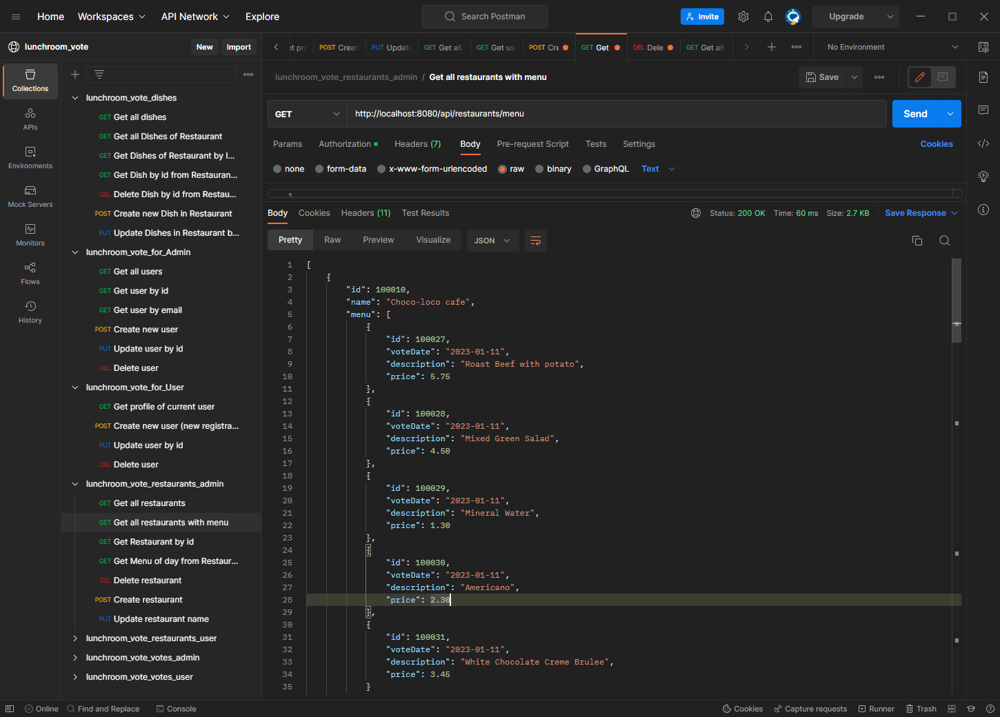

# Lunch-voting system

### Technical requirement:

Design and implement a REST API using Hibernate/Spring/SpringMVC (Spring-Boot preferred!) without frontend.

## Task

- 2 types of users: admin and regular users
- Admin can input a restaurant and it's lunch menu of the day (2-5 items usually, just a dish name and price)
- Menu changes each day (admins do the updates)
- Users can vote on which restaurant they want to have lunch at
- Only one vote counted per user
- If user votes again the same day:
    * If it is before 11:00 we assume that he changed his mind.
    * If it is after 11:00 then it is too late, vote can't be changed
- Each restaurant provides new menu each day.

## Installation

    https://github.com/Alima-T/lunchroom_vote

==================

## Run

- Username: `sa`, no password
- JDBC URL: `jdbc:hsqldb:mem:lunchroom_vote`
- Remote connection URL: `jdbc:h2:tcp://localhost:9092/mem:lunchroom_vote`

==================

## Testing

<a href=https://postman.com/okhapka/workspace/lunchroom-vote>Testing the web API with Postman collections, including
endpoints and body, is available at this link. Use desktop Postman</a>

==================

## Dish

- <a href="http://localhost:8080/api/admin/dishes">List of all Dishes</a>
- <a href="http://localhost:8080/api/admin/dishes/100007/100012">Get Dish id=100012 from Restaurant id=100007</a>
- <a href="http://localhost:8080/api/admin/dishes/100007/by-date?voteDate=2022-01-10">List of Dishes from Restaurant with id=100007 and voteDate = 2022-01-10</a>
- <a href="http://localhost:8080/api/admin/dishes/100008">List of Dishes from Restaurant id=100008</a>
- <a href="http://localhost:8080/api/admin/dishes/100007">Create Dishes in Restaurant id=100007</a>
- <a href="http://localhost:8080/api/admin/dishes/100007">Update Dishes by id in Restaurant id=100007</a>
- <a href="http://localhost:8080/api/admin/dishes/100009/100045">Delete from Restaurant with id=100009 Dish with id=100045</a>

CURL:

    curl -s http://localhost:8080/api/admin/dishes --user admin@gmail.com:admin
    curl -s http://localhost:8080/api/admin/dishes/100007/100012 --user admin@gmail.com:admin
    curl -s http://localhost:8080/api/admin/dishes/100007/by-date?voteDate=2022-11-27 --user admin@gmail.com:admin
    curl -s http://localhost:8080/api/admin/dishes/100008 --user admin@gmail.com:admin
    curl -s -X POST -d '{"voteDate": "2022-01-10", "description": "New dish", "price": 0.00}' -H 'Content-Type:application/json;charset=UTF-8' http://localhost:8080/api/admin/dishes/100007 --user admin@gmail.com:admin
    curl -s -X PUT -d '{"id": 100045, "voteDate": "2022-01-10", "description": "Updated dish", "price": 0.00}' -H 'Content-Type: application/json' http://localhost:8080/api/admin/dishes/100007 --user admin@gmail.com:admin
    curl -s -X DELETE http://localhost:8080/api/admin/dishes/100009/100025 --user admin@gmail.com:admin

==================

## Admin

- <a href="http://localhost:8080/api/admin/users">List of Users</a>
- <a href="http://localhost:8080/api/admin/users/100000">User with id=100000 </a>
- <a href="http://localhost:8080/api/admin/users/by-email?email=olef@gmail.com">Users by Email</a>
- <a href="http://localhost:8080/api/admin/users">Create new User</a>
- <a href="http://localhost:8080/api/admin/users/100005">Update User with id=100005</a>
- <a href="http://localhost:8080/api/admin/users/100005">Delete User with id=100005 </a>

CURL:

     curl -s 'http://localhost:8080/api/admin/users --user admin@gmail.com:admin'
     curl -s 'http://localhost:8080/api/admin/users/100000 --user admin@gmail.com:admin'
     curl -s 'http://localhost:8080/api/admin/users/by-email?email=olef@gmail.com --user admin@gmail.com:admin'
     curl -s -X POST -d '{"name": "New user", "email": "new_user@gmail.com", "password": "password"}' -H 'Content-Type: application/json;charset=UTF-8' http://localhost:8080/api/admin/users --user admin@gmail.com:admin'
     curl -s -X PUT -d '{"name": "Updated user", "email": "updated_user@gmail.com", "password": "password"}' -H 'Content-Type: application/json' http://localhost:8080/api/admin/users/100005 --user admin@gmail.com:admin'
     curl -s -X DELETE http://localhost:8080/api/admin/users/100005 --user admin@gmail.com:admin'

==================

## User

- <a href="http://localhost:8080/api/user/profile">Get current user's profile</a>
- <a href="http://localhost:8080/api/user/profile">Create new User - new registration</a>
- <a href="http://localhost:8080/api/user/profile">Update current User</a>
- <a href="http://localhost:8080/api/user/profile">Delete current User </a>

CURL:

     curl -s 'http://localhost:8080/api/user/profile --user bob@gmail.com:password'
     curl -s -X POST -d '{"name": "New User", "email": "new_user@gmail.com", "password": "password"}' -H 'Content-Type: application/json;charset=UTF-8' http://localhost:8080/api/user/profile'
     curl -s -X PUT -d '{"name": "Updated user", "email": "updated_user@gmail.com", "password": "password"}' -H 'Content-Type: application/json' http://localhost:8080/api/user/profile --user bob@gmail.com:password'
     curl -s -X DELETE 'http://localhost:8080/api/user/profile --user bob@gmail.com:password'

==================

## Restaurant

### ***RestaurantAdmin***

- <a href="http://localhost:8080/api/admin/restaurants">GetAll Restaurants</a>
- <a href="http://localhost:8080/api/admin/restaurants/menu">GetAll Restaurants with menu</a>
- <a href="http://localhost:8080/api/admin/restaurants/100010">Get Restaurant with id=100010</a>
- <a href="http://localhost:8080/api/admin//restaurants/100010/menu ">Menu of day from Restaurant id=100010</a>
- <a href="http://localhost:8080/api/admin/restaurants">Create new Restaurant</a>
- <a href="http://localhost:8080/api/admin/restaurants">Update Restaurant with id=00010</a>
- <a href="http://localhost:8080/api/admin/restaurants/100010">Delete Restaurant with id=00010</a>

CURL:

    curl -s http://localhost:8080/api/admin/restaurants --user admin@gmail.com:admin'
    curl -s http://localhost:8080/api/admin/restaurants/menu --user admin@gmail.com:admin
    curl -s http://localhost:8080/api/admin/restaurants/100010 --user admin@gmail.com:admin
    curl -s http://localhost:8080/api/admin/restaurants/100010/menu --user admin@gmail.com:admin
    curl -s -X POST -d '{"name": "New restaurant"}' -H 'Content-Type: application/json;charset=UTF-8' http://localhost:8080/api/admin/restaurants --user admin@gmail.com:admin
    curl -s -X PUT -d '{"id": "100045", "name": "Updated restaurant"}' -H 'Content-Type: application/json' http://localhost:8080/api/admin/restaurants --user admin@gmail.com:admin
    curl -s -X DELETE http://localhost:8080/api/admin/restaurants/100010 --user admin@gmail.com:admin

### ***RestaurantUser***

- <a href="http://localhost:8080/api/user/restaurants/menu">List of Restaurants with menu</a>
- <a href="http://localhost:8080/api/user/restaurants/100009/menu">Menu from Restaurant with id=100010 for current day</a>

CURL:

    curl -s http://localhost:8080/api/user/restaurants/menu --user bob@gmail.com:password
    curl -s http://localhost:8080/api/user/restaurants/100009/menu --user bob@gmail.com:password

==================

## Vote

### ***VoteAdmin***

- <a href="http://localhost:8080/api/admin/votes">List of all Votes</a>
- <a href="http://localhost:8080/api/admin/votes/100040">Vote id=100040</a>
- <a href="http://localhost:8080/api/admin/votes/user-and-date?voteDate=2022-01-10&userId=100000">List of Votes for User with id=100000 by VoteDate = 2022-01-10</a>
- <a href="http://localhost:8080/api/admin/votes/date?voteDate=2022-01-10">List of Votes by VoteDate = 2022-01-10</a>
- <a href="http://localhost:8080/api/admin/votes/100007/date?voteDate=2022-01-10">List of Votes from Restaurant with id=100007 on VoteDate = 2022-01-10</a>
- <a href="http://localhost:8080/api/admin/votes?userId=100006&restaurantId=100007">Create Vote in Restaurant with id=100007</a>
- <a href="http://localhost:8080/api/admin/votes/100040?restaurantId=100007">Update Vote id=100040 in Restaurant with id=100007</a>
- <a href="http://localhost:8080/api/admin/votes/100040?restaurantId=100007">Delete Vote id=100040 from Restaurant with id=100007</a>

CURL:

    curl -s http://localhost:8080/api/admin/votes --user admin@gmail.com:admin
    curl -s http://localhost:8080/api/admin/votes/100040 --user admin@gmail.com:admin
    curl -s http://localhost:8080/api/admin/votes/user-and-date?voteDate=2022-01-10&userId=100000 --user admin@gmail.com:admin
    curl -s http://localhost:8080/api/admin/votes/date?voteDate=2022-01-10 --user admin@gmail.com:admin
    curl -s http://localhost:8080/api/admin/votes/100007/date?voteDate=2022-01-10 --user admin@gmail.com:admin
    curl -s -X POST -d '{"restaurantId": "100007"}' -H 'Content-Type: application/json;charset=UTF-8' "http://localhost:8080/api/admin/votes?userId=100001&restaurantId=100007" --user admin@gmail.com:admin
    curl -s -X PUT -d '{"restaurantId": "100007"}' -H 'Content-Type: application/json' http://localhost:8080/api/admin/votes/100040?restaurantId=100007 --user admin@gmail.com:admin
    curl -s -X DELETE http://localhost:8080/api/admin/votes/100040 --user admin@gmail.com:admin

### ***VoteUser***

- <a href="http://localhost:8080/api/user/profile/votes">List of Votes of User id=100000</a>
- <a href="http://localhost:8080/api/user/profile/votes?restaurantId=100007">Create Vote by User in Restaurant id=100007</a>
- <a href="http://localhost:8080/api/user/profile/votes/100040?restaurantId=100007">Update by User Vote id=100040 in Restaurant with id=00007</a>

CURL:

    curl -s http://localhost:8080/api/user/profile/votes --user bob@gmail.com:password
    curl -s -X POST -d '{"restaurantId": "100007"}' -H 'Content-Type: application/json;charset=UTF-8' http://localhost:8080/api/user/profile/votes?restaurantId=100007 --user bob@gmail.com:password
    curl -s -X PUT -d '{"restaurantId": "100010"}' -H 'Content-Type: application/json' http://localhost:8080/api/user/profile/votes/100037?restaurantId=100010 --user bob@gmail.com:password

